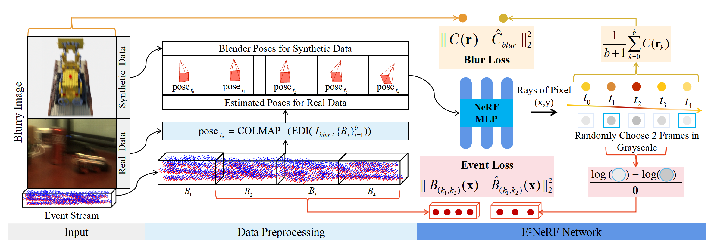

# Code for E<sup>2</sup>NeRF: Event Enhanced Neural Radiance Fields from Blurry Images (ICCV 2023)
This is an official PyTorch implementation of the E<sup>2</sup>NeRF. Click [here](https://icvteam.github.io/E2NeRF.html) to see the video and supplementary materials in our project website. 

## Method Overview



## Installation
The code is based on [nerf-pytorch](https://github.com/yenchenlin/nerf-pytorch).
Please refer to its github [website](https://github.com/yenchenlin/nerf-pytorch) for the environment installation.

## Dataset
Download the dataset [here](https://drive.google.com/drive/folders/1XhOEp4UdLL7EnDNyWdxxX8aRvzF53fWo?usp=sharing).
The dataset contains the "data" for training and the "original data".

### Synthetic Data: 
For the file of each scene, there are training images in the "train" file and the corresponding event data "events.pt". The ground truth images are in the "test" file.

Like in original NeRF, the training and testing poses are in the "transform_train.json" file and "transform_test.json" file.
Notice that at the test time, we use the first pose of each view in "transform_test.json" to render the test images and the Ground Truth images are also rendered at this pose.

### Real-World Data: 
The structure is like original NeRF's llff data and the event data is in "event.pt". 

### Event Data:
For easy reading, we transform the event stream in to event bins as event.pt file. You can use pytorch to load the file. The shape of the tensor is (view_number, bin_number, H, W) and each element means the number of the events (positive and negative indicate polarity).

## Original Data & Preproccesing
### Synthetic Data:
There are original images for synthesizing the blurry image and the code. Besides, we supply the original event data generated from v2e. We also provide the code to transform the ".txt" event to "events.pt" for E<sup>2</sup>NeRF training.

### Real-World Data:
We supply the original ".aedat4" data captured by davis346 and the processing code in the file. We also convert the event data into events.pt for training. 

### EDI:
We update the EDI code in the repository. 
You can use this code to deblur the images in the "train" file with corresponding events.pt data.
And the deblurred images are saved at "images_for_colmap" file.
Then, you can use colmap to generate the poses as in NeRF.


## Citation

If you find this useful, please consider citing our paper:

```bibtex
@inproceedings{qi2023e2nerf,
  title={E2nerf: Event enhanced neural radiance fields from blurry images},
  author={Qi, Yunshan and Zhu, Lin and Zhang, Yu and Li, Jia},
  booktitle={Proceedings of the IEEE/CVF International Conference on Computer Vision},
  pages={13254--13264},
  year={2023}
}
```

## Acknowledgment

The overall framework are derived from [nerf-pytorch](https://github.com/yenchenlin/nerf-pytorch/). We appreciate the effort of the contributors to these repositories.
